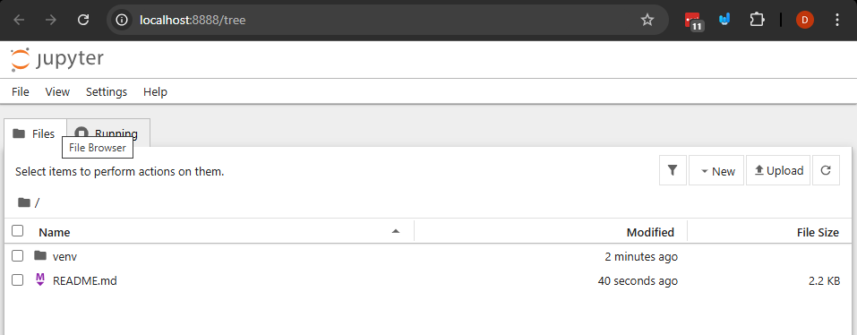
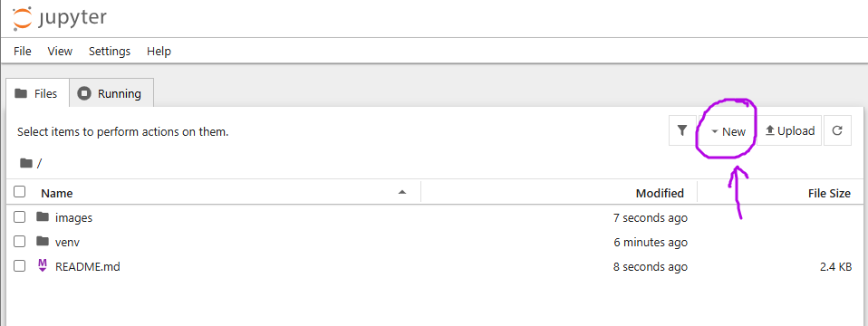
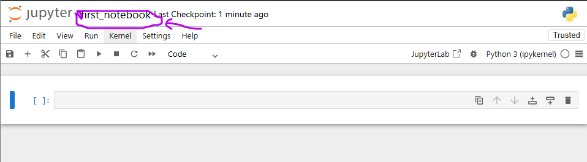

# Using Jupyter Notebooks with Pandas Fundamentals


## Why is this important?

A lot of data analysis and data science is done in Jupyter Notebooks. Pandas is one of the most popular libraries for data manipulation and analysis in Python. Combining Jupyter Notebooks with Pandas allows for interactive data exploration and visualization, making it easier to understand and communicate insights from data.

In future courses you might use a platform like google colab or a jupyterhub instance to run notebooks in the cloud. But it's also useful to know how to set up and run Jupyter Notebooks on your own machine.

## What are we going to do?

Install Jupyter and Pandas in a virtual environment, and create a simple notebook that uses Pandas to analyze some data.

## Steps

### 1. Create a virtual environment and install jupyter and pandas

1. create the virtual environment, and activate it:
```bash
python -m venv ./venv
.\venv\Scripts\activate # Or source ./venv/bin/activate on macOS/Linux
```
2. install jupyter and pandas:
```bash
pip install jupyter pandas
```
3. Save the dependencies to a requirements file:
```bash
pip freeze > requirements.txt
```

### 2. Start the Jupyter Notebook server

This is going to be a local server, that we're going to leave running while we work with our notebooks.

```bash
jupyter notebook
```
This command will open a new tab in your web browser, showing the Jupyter Notebook interface.
- This interface allows you to create, open, and manage notebooks.
- The server will keep running in your terminal until you stop it (Ctrl+C).

The output of the command will look something like this:
```
[I 2025-10-30 15:53:01.821 ServerApp] Extension package jupyter_lsp took 0.4615s to import
... removed for brevity ...
[C 2025-10-30 15:53:08.423 ServerApp]
    To access the server, open this file in a browser:
        file:///C:/Users/dmouris/AppData/Roaming/jupyter/runtime/jpserver-22644-open.html
    Or copy and paste one of these URLs:
        http://localhost:8888/tree?token=24a6388ea60038814d52a16a492093273f84408b37da5f00
        http://127.0.0.1:8888/tree?token=24a6388ea60038814d52a16a492093273f84408b37da5f00```
```

The jupyter interface should open automitcally and look a bit like this:


### 3. Create a new notebook in jupyter

1. In the Jupyter interface, click on "New" and select "Python 3" to create a new notebook.
Here's where it is located:


2. This should create a new notebook with an empty code cell. Rename the file to `first_notebook` by clicking on the title at the top.
It should look like this:


3. Inside of these code cells you can write and execute Python code interactively.
Note: you can also change these to markdown cells for text and documentation.
In the first cell let's just do a print statement to see that everything is working:
```python
print("Hello, Jupyter with Pandas!")
```
Execute the cell by pressing Shift+Enter. You should see the output below the cell.

### 4. Use Pandas in the notebook and use some data.

Pandas is a powerful library, here's a link to the documentation: https://pandas.pydata.org/docs/

For this example we're going to load data from the city of edmonton's open data portal about current property assessments. To get the [most recent data go here](https://data.edmonton.ca/City-Administration/Property-Assessment-Data-Current-Calendar-Year-/q7d6-ambg/about_data) and click export -> CSV to download the data.

If you just want to following along without downloading the data, you can use the csv in the `data` folder in this repo.
1. First, import pandas at the top of your notebook:
```python
import pandas as pd
```
2. Next, load the CSV data into a pandas DataFrame. Adjust the file path as necessary:
```python
property_data = pd.read_csv('data/Property_Assessment_Data_(Current_Calendar_Year)_20251030.csv')
```

The `property_data` is a variable that hold what's called a `DataFrame`, which is a table-like data structure in pandas. We're going to take a look at the docs for `DataFrame` so we can see some stuff we can do with it.

3. Now you can explore the data. For example, display the first few rows:
```python
property_data.head()
```

Note do this with seperate cells in the new notebook (you can add new cells with the + button in the toolbar, or by pressing B in command mode), there's also an you can refer to the [appendix](#appendix-handy-jupyter-shortcuts) for some useful shortcuts.

### 5. Let's take a look at some operations that we can do with our pandas `DataFrame`

For each of the following cells we're going to create a new cell in the notebook and run the code to see the output

1. Get a summary of the DataFrame:
```python
property_data.info()
```
2. Let's how many rows and columns we have:

```python
property_data.shape
```
This will return a tuple with the number of rows and columns.

3. Let's get some basic statistics about the numerical columns:
```python
property_data.describe()
```
This is going to give us count, mean, std, min, max, and quartiles for all the numerical columns, which is super useful for getting a quick overview of the data.

4. Let's take a look at all of the neighbourhoods in the data:
```python
property_data["Neighbourhood"].unique()
```
This is going list all of the unique values in the "Neighbourhood" column.

### 6. Let's filter and sort the data to a specific neighborhood

For each of the following cells we're going to create a new cell in the notebook and run the code to see the output

1. Let's say we want to filter the data to see all properties in a specific neighborhood, for example "Downtown":
```python
downtown_properties = property_data[property_data['Neighbourhood'] == 'DOWNTOWN']
print(F"Number of properties in downtown {downtown_properties.shape[0]}")

downtown_properties.head()
```

2. Let's sort the downtown properties by assessed value in descending order:
```python
sorted_downtown = downtown_properties.sort_values(by='Assessed Value', ascending=False)
sorted_downtown.head()
```

3. Let's display the top 10 most expensive properties in downtown:
```python
print(sorted_downtown[:10])
```
This is going to show us the top 10 most expensive properties in downtown Edmonton based on the assessed value.
Note: the data isn't that nice to look at so let's just take a look at few columns

4. Let's display only the Address, Assessed Value, and Property Type columns for the top 10 most expensive properties in downtown:
```python
print(sorted_downtown[['House Number', 'Street Name',  'Assessed Value']][:10])
```
## Exercises

Using what you've learned so far, try to answer the following questions by creating new cells in your notebook:

1. How many properties are there in the
"ELLERSLIE" neighborhood?

2. What is the average assessed value of properties in the "KINGSWAY" neighborhood?

3. Get the top 3 most expensive properties in the "EDMONTON SOUTH WEST" neightbourhood.

## Summary

In this lesson we covered how to set up a virtual environment, install Jupyter and Pandas, and create a simple Jupyter Notebook to explore and analyze data using Pandas.

## Appendix: handy jupyter shortcuts
| Command                     | Description                                      |
| --------------------------- | ------------------------------------------------ |
| `Shift + Enter`             | Run the current cell and move to the next cell   |
| `Ctrl + Enter`              | Run the current cell and stay in it              |
| `Alt + Enter`               | Run the current cell and insert a new one below  |
| `Esc`                       | Enter command mode (blue border)                 |
| `Enter`                     | Enter edit mode (green border)                   |
| `A` (in command mode)       | Insert a new cell **above**                      |
| `B` (in command mode)       | Insert a new cell **below**                      |
| `D, D` (press D twice)      | Delete the selected cell                         |
| `Z`                         | Undo the last cell deletion                      |
| `M`                         | Change cell to **Markdown**                      |
| `Y`                         | Change cell to **Code**                          |
| `L`                         | Toggle line numbers in the current cell          |
| `Shift + M`                 | Merge selected cells                             |
| `Ctrl + S`                  | Save the notebook                                |
| `0, 0` (press 0 twice)      | Restart the kernel                               |
| `I, I` (press I twice)      | Interrupt the kernel                             |
| `Ctrl + /`                  | Toggle comment on selected lines (in edit mode)  |
| `Ctrl + Shift + -`          | Split a cell at the cursor                       |
| `Tab`                       | Autocomplete or show function signature          |
| `Shift + Tab`               | Show tooltip/documentation for an object         |
| `!command`                  | Run a shell command (e.g. `!ls`, `!pip install`) |
| `%time`                     | Measure execution time of a single line of code  |
| `%%time`                    | Measure execution time of a whole cell           |
| `%who`                      | List all variables in the namespace              |
| `%whos`                     | Detailed list of variables with types and sizes  |
| `%pwd`, `%cd`, `%ls`        | File system navigation commands                  |
| `%matplotlib inline`        | Display plots inline (common for matplotlib)     |
| `?object` or `help(object)` | Show documentation for an object                 |
