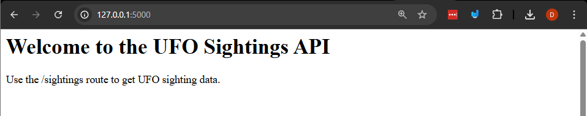
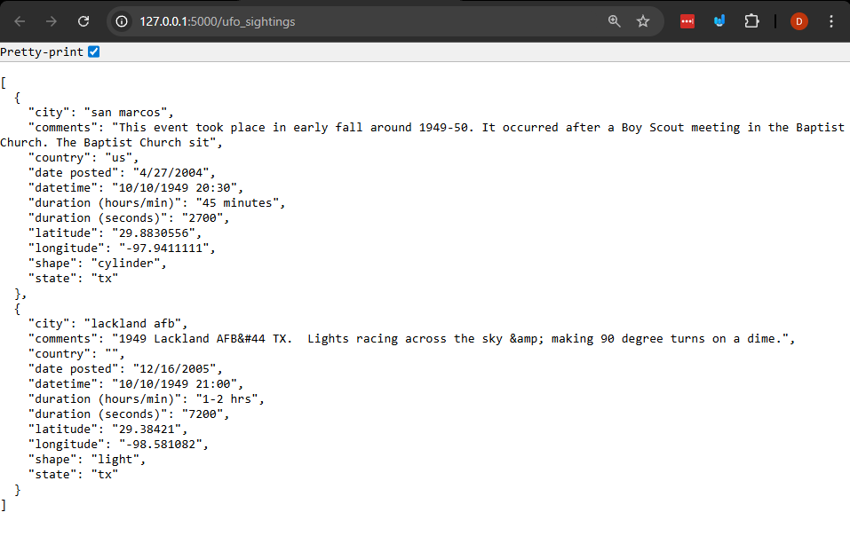
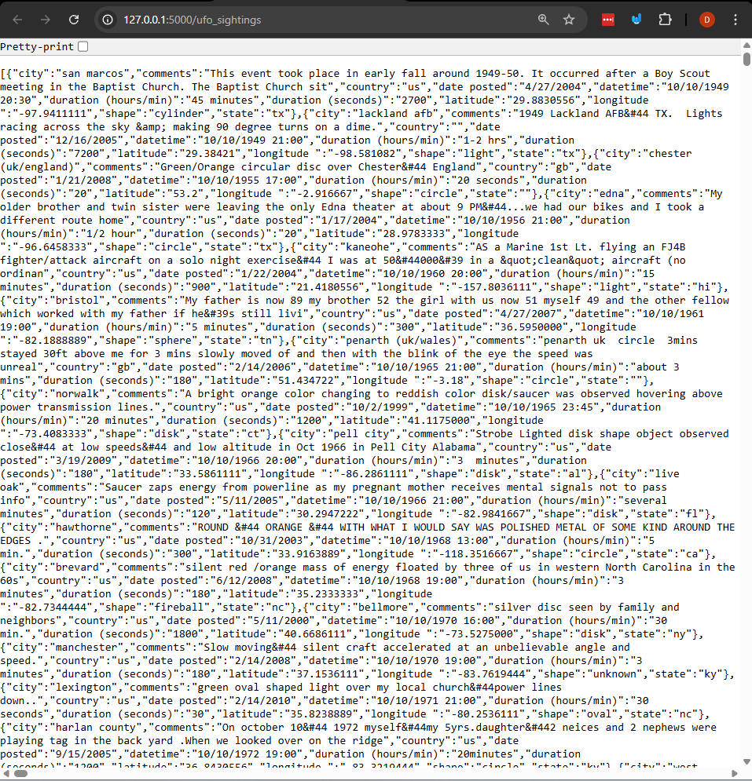

# Flask Fundamentals

## Why is this important?

Flask is a really popular web framework for Python. It allows you to create web applications really quickly and easily. Understanding how to use Flask is a great first step into web development with Python, and it will give you a foundation to build more complex applications in the future. This is used a lot for building APIs and web services.

This knowledge is really useful for you to pair with your frontend skills (like HTML, CSS, and JavaScript) to create full-stack web applications.

Flask is a lightweight framework, in future courses you'll use more complex frameworks that have more features built-in.

## What are we going to do?

We're going to create a simple web application that returns data about UFO sightings. We'll create routes about UFO sightings and allow users to filter the data based on certain criteria.

[Flask Docs](https://flask.palletsprojects.com/en/stable/)

[Source for data](https://www.kaggle.com/datasets/NUFORC/ufo-sightings)

## Steps

### 1. Create a virtual environment and install flask
1. create the virtual environment, and activate it:
```bash
python -m venv ./venv
.\venv\Scripts\activate # Or source ./venv/bin/activate on macOS/Linux
```
2. install flask:
```bash
pip install flask
```
3. Save the dependencies to a requirements file:
```bash
pip freeze > requirements.txt
```

### 2. Create a simple flask application

1. To create a simple flask application create a new file called `ufo_app.py` and add the following code:
```python
from flask import Flask, request, jsonify
app = Flask(__name__)
```
- This code imports the Flask class and creates an instance of it.

2. We can create a page that returns a simple message by adding the following code to `ufo_app.py`:
```python
@app.route('/')
def home():
    return """
    <html>
        <head>
            <title>UFO Sightings</title>
        </head>
        <body>
            <h1>Welcome to the UFO Sightings API</h1>
            <p>Use the /sightings route to get UFO sighting data.</p>
        </body>
    </html>
    """
```
- This code creates a route for the home page that returns a simple HTML message.

### 3. Let's run the application.

There's a few different ways to run a flask application.

Option 1: Using the flask command line tool.
```bash
set FLASK_APP=ufo_app.py      # On Windows
export FLASK_APP=ufo_app.py   # On macOS/Linux
flask run
```
or Option 2: Running the ufo_app.py file directly.
```bash
flask --app ufo_app run
```
The output of the command should look something like this:
```
$ flask --app ufo_app run
 * Serving Flask app 'ufo_app'
 * Debug mode: off
WARNING: This is a development server. Do not use it in a production deployment. Use a production WSGI server instead. * Running on http://127.0.0.1:5000
Press CTRL+C to quit
```
Note: just like with jupyter notebooks, the flask server will keep running in your terminal until you stop it (Ctrl+C).

You can now open your web browser and go to [`http://127.0.0.1:5000`](http://127.0.0.1:5000/) to see the home page of your application.

When you open the link you should see something like this:


You've just created and run your first Flask application woo!

### 4. Create a route to return UFO sighting data

1. Let's create a new router that returns UFO sighting data. Add the following code to `ufo_app.py`:
```python
ufo_sightings = [
    {
        "datetime": "10/10/1949 20:30",
        "city": "san marcos",
        "state": "tx",
        "country": "us",
        "shape": "cylinder",
        "duration (seconds)": "2700",
        "duration (hours/min)": "45 minutes",
        "comments": "This event took place in early fall around 1949-50. It occurred after a Boy Scout meeting in the Baptist Church. The Baptist Church sit",
        "date posted": "4/27/2004",
        "latitude": "29.8830556",
        "longitude": "-97.9411111"
    },
    {
        "datetime": "10/10/1949 21:00",
        "city": "lackland afb",
        "state": "tx",
        "country": "",
        "shape": "light",
        "duration (seconds)": "7200",
        "duration (hours/min)": "1-2 hrs",
        "comments": "1949 Lackland AFB&#44 TX.  Lights racing across the sky &amp; making 90 degree turns on a dime.",
        "date posted": "12/16/2005",
        "latitude": "29.38421",
        "longitude": "-98.581082"
    }
]
```
2. Now add the following code to create a new route that returns the UFO sighting data:
```python
@app.route('/ufo_sightings', methods=['GET'])
def get_sightings():
    return jsonify(ufo_sightings)
```

All this does is create a new route `/ufo_sightings` that returns the UFO sighting data in JSON format.

3. Restart your flask server and go to [`http://127.0.0.1:5000/ufo_sightings`](http://127.0.0.1:5000/ufo_sightings)

Your browser should display the UFO sighting data in JSON format like this:



### 5. Let's read the data from a CSV file
1. Let's use the the `csv` module to read the `data\scrubbed.csv` file and load the data into our application. First, import the `csv` module at the top of `ufo_app.py`:
```python
import csv
```
2. Next, create a function to read the CSV file and load the data into a list of dictionaries. Add the following code to `ufo_app.py`:
```python
def load_ufo_data(filepath):
    sightings = []
    with open(filepath, mode='r', encoding='utf-8') as file:
        csv_reader = csv.DictReader(file)
        for row in csv_reader:
            sightings.append(row)
    return sightings
```
3. Now, modify the `get_sightings` function to use the `load_ufo_data` function to read the data from the CSV file. Update the `get_sightings` function like this:
```python
@app.route('/ufo_sightings', methods=['GET'])
def get_sightings():
    sightings = load_ufo_data('data/scrubbed.csv')
    return jsonify(sightings)
```

4. Restart your flask server and go to [`http://127.0.0.1:5000/ufo_sightings`](http://127.0.0.1:5000/ufo_sightings)

Now you should see all of the UFO sighting data from the CSV file displayed in JSON format!
It should look like this:


Note: this may take a few seconds to load since there is a lot of data.

You might be thinking "wow this is a lot of data to send at once". You're right! In a real application you would want to implement pagination to limit the amount of data sent at once. But for this example, we're keeping it simple.


## Exercises

Add a new route that allows users to see UFO all of the UFO siightings from the `data/complete.csv` file.

## Summary

This lesson introduced you to Flask, a popular web framework for Python. You learned how to create a simple web application that returns data about UFO sightings. You also learned how to read data from a CSV file and return it in JSON format.
