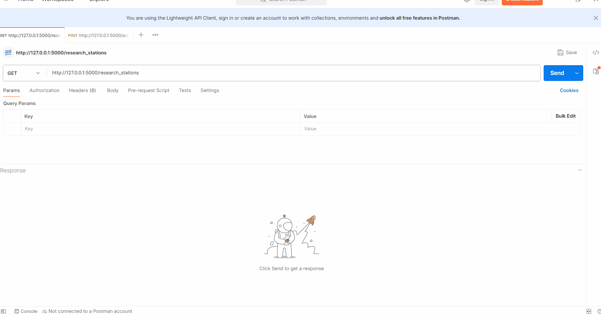

# Flask Fundamentals, Using Query Parameters

## Why is this important?

In Flask and all web frameworks, query parameters are a way to send additional information to the server as part of a URL. They are commonly used for filtering, sorting, and paginating data in web applications. Understanding how to use query parameters is essential for building dynamic and interactive web applications.

We're also going to look how to post data to a Flask application using query parameters as well.

## What are we going to do?

We're going to extend our simple Flask application that returns data about UFO sightings. We'll add functionality to filter the data based on query parameters provided in the URL.

We're also going to post data to the flask application and see how to handle that data and post it to a file.

[Flask Docs](https://flask.palletsprojects.com/en/stable/)

[Source for data](https://www.kaggle.com/datasets/NUFORC/ufo-sightings)

[Postman](https://www.postman.com/downloads/) - A tool for testing APIs

## Steps

### 1. Create a virtual environment and install flask and run the application
1. create the virtual environment, and activate it:
```bash
python -m venv ./venv
.\venv\Scripts\activate # Or source ./venv/bin/activate on macOS/Linux
```
2. install flask:
```bash
pip install flask
```
3. Save the dependencies to a requirements file:
```bash
pip freeze > requirements.txt
```
4. Run the application:
```bash
flask --app ufo_app run --reload
```
Note: the `--reload` flag is useful during development as it automatically restarts the server when code changes are detected.

### 2. Let's add a query parameter to filter the UFO sightings by country.

1. Open the `ufo_app.py` file and modify the `get_sightings` function to read the `country` query parameter from the request URL, add a `breakpoint()` for debugging and use the `request.args` to get the value of the `country` parameter.
```python
import csv
from flask import Flask, request, jsonify
app = Flask(__name__)

# ... existing code ...

@app.route('/ufo_sightings', methods=['GET'])
def get_sightings():
    country = request.args.get('country', '')
    breakpoint()
    scrubbed_sightings = load_ufo_data('data/scrubbed.csv')

    return jsonify(scrubbed_sightings)
```
Note: you can use a `breakpoint()` to pause execution of your code in flask so that you can inspect the request object and see the query parameters.

Here we're using `request.args.get('country', '')` to get the value of the `country` query parameter. If the parameter is not provided, it defaults to an empty string.

2. Let's execute the code and test it out. Open your browser (or a tool like Postman) and navigate to: [http://127.0.0.1:5000/ufo_sightings?country=ca](http://127.0.0.1:5000/ufo_sightings?country=ca)
- you should be able to see something like this in your terminal where the breakpoint is hit and you take a look at the `request.args` and the `country` variable:
```
127.0.0.1 - - [14/Nov/2025 09:48:56] "GET /ufo_sightings?country=ca HTTP/1.1" 200 -
 * Detected change in 'C:\\Users\\dmouris\\course_development\\sdev1001_programming_fundamentals\\sdev1001-master-course\\packages_and_virtualenv\\flask_using_query_parameters_end\\ufo_app.py', reloading
 * Restarting with stat
> c:\users\dmouris\course_development\sdev1001_programming_fundamentals\sdev1001-master-course\packages_and_virtualenv\flask_using_query_parameters_end\ufo_app.py(30)get_sightings()
-> breakpoint()
(Pdb) country
'ca'
(Pdb) request.args
ImmutableMultiDict([('country', 'ca')])
(Pdb) request.args["country"]
'ca'
```

### 3. Now let's filter the UFO sightings based on the `country` query parameter.
1. Modify the `get_sightings` function to filter the UFO sightings based on the `country` parameter:
```python
# ... existing code ...
@app.route('/ufo_sightings', methods=['GET'])
def get_sightings():
    country = request.args.get('country', '')
    scrubbed_sightings = load_ufo_data('data/scrubbed.csv')
    # make a copy of the list to avoid modifying it while iterating
    filtered_sightings = scrubbed_sightings.copy()
    for sighting in scrubbed_sightings:
        # If a country is specified and it doesn't match, remove the sighting
        if country and sighting['country'].lower() != country.lower():
            filtered_sightings.remove(sighting)
    # Return the filtered list as JSON
    return jsonify(filtered_sightings)
```
2. Test the filtering functionality by navigating to: [http://127.0.0.1:5000/ufo_sightings?country=ca](http://127.0.0.1:5000/ufo_sightings?country=ca)

With this you'll see that only the UFO sightings from Canada (`ca`) are returned.

### 4. Let's add some pagination to our UFO sightings endpoint.
1. Modify the `get_sightings` function to add pagination using `page` and `per_page` query parameters:
```python
# ... existing code ...
@app.route('/ufo_sightings', methods=['GET'])
def get_sightings():
    country = request.args.get('country', '')
    page = int(request.args.get('page', 1))
    per_page = int(request.args.get('per_page', 10))
    scrubbed_sightings = load_ufo_data('data/scrubbed.csv')
    # Filter sightings by country
    filtered_sightings = scrubbed_sightings.copy()
    for sighting in scrubbed_sightings:
        # If a country is specified and it doesn't match, remove the sighting
        if country and sighting['country'].lower() != country.lower():
            filtered_sightings.remove(sighting)
    # Implement pagination
    start = (page - 1) * per_page
    end = start + per_page
    paginated_sightings = filtered_sightings[start:end]
    return jsonify(paginated_sightings)
```
This adds the ability to paginate the results by specifying the `page` and `per_page` query parameters. We can see here that we add the default for `page` is 1 and for `per_page` is 10.

2. Test the pagination functionality by navigating to: [http://127.0.0.1:5000/ufo_sightings?country=ca&page=2&per_page=5](http://127.0.0.1:5000/ufo_sightings?country=ca&page=2&per_page=5)
- Now you can see that only 5 results are returned for page 2 of the Canadian UFO sightings.

### 6. Create a new endpoint to list research stations.
1. Add a new route to the `ufo_app.py` file to return a list of research stations from a CSV file:
```python
@app.route('/research_stations', methods=['GET'])
def get_research_stations():
    stations = []
    with open('data/research_stations.csv', mode='r') as file:
        csv_reader = csv.DictReader(file)
        for row in csv_reader:
            stations.append(row)
    return jsonify(stations)
```
2. Test the new endpoint by navigating to: [http://127.0.0.1:5000/research_stations](http://127.0.0.1:5000/research_stations)

### 6. Let's add new endpoint to add a new research station with the POST method using `request.get_json()`.
1. Add a new route to the `ufo_app.py` file to add a new research station:
```python
## ... existing code ...

@app.route('/add_research_station', methods=['POST'])
def add_research_station():
    data = request.get_json()
    name = data.get('name')
    location = data.get('location')
    if not name or not location:
        # the second parameter is status code 400 for bad request
        return jsonify({'error': 'Name and location are required'}), 400
```
Here you see if either the `name` or `location` query parameters are missing, we return an error message with a 400 status code.
Note: now if you test this in the browser it won't work because browsers only do GET requests. You can use a tool like Postman or curl to test POST requests.

2. Continue to append the new research station to the CSV file:
```python
## ... existing code ...

@app.route('/add_research_station', methods=['POST'])
def add_research_station():
    data = request.get_json()
    name = data.get('name')
    location = data.get('location')
    if not name or not location:
        # the second parameter is status code 400 for bad request
        return jsonify({'error': 'Name and location are required'}), 400
    # below we append the new research station to the CSV file
    with open('data/research_stations.csv', mode='a', newline='') as file:
        fieldnames = ['name', 'location']
        writer = csv.DictWriter(file, fieldnames=fieldnames)
        writer.writerow({'name': name, 'location': location})
    return jsonify({'message': 'Research station added successfully'}), 201
```
3. Test the new POST endpoint using Postman. We're going to test the get request, send the POST request and then do another get request to see the new research station added. It should look something like this:

You should also see the new research station added to the `data/research_stations.csv` file is updated to look like this:
```csv
name,location
Aerial Phenomena Research Lab,Nevada USA
Deep Space Materials Institute,Alberta Canada
Dan's alien research lab,Alberta Canada
```

## Exercises

1. Extend the UFO sightings endpoint to allow filtering by shape in addition to country.
2. Create a new endpoint that lists the space organization from the `data/space_organizations.csv` file. Add pagination to this endpoint as well.
3. Create a new POST endpoint to add a new space organization to the `data/space_organizations.csv` file.

## Summary

In this lesson, we learned how to use query parameters in Flask to filter and paginate data. We also saw how to handle POST requests to add new data to our application. These techniques are fundamental for building dynamic web applications that can respond to user input and manage data effectively.
